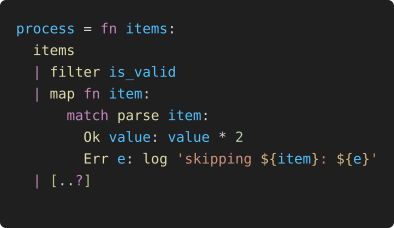

# ƒink

A functional programming language designed to be ergonomic, consistent, and practical — applying FP principles without being dogmatic.

## Key characteristics

- Indentation-based, expression-oriented syntax
- Immutable by default
- Type Inference — annotations are the exception, not the rule
- Pattern matching as a first-class citizen
- Pipes for readable left-to-right composition
- String templating/interpolation

## Status

The compiler is under active development. Early stage — not yet ready for use.

## Links

- Website: https://fink-lang.org
